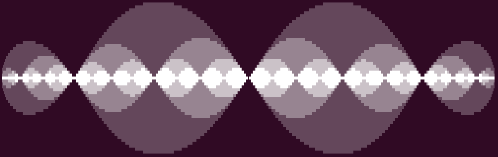

# Frascii
ASCII-visualizations of Fractals for the Ubuntu (or other) Terminal

Install using `pip install frascii`

# Commands

`frascii sierpinski_carpet <n>`: Displays the n-th iteration of the [Sierpinski Carpet](https://en.wikipedia.org/wiki/Sierpinski_carpet).

`frascii sierpinski_triangle <n>`: Displays the n-th iteration of the [Sierpinski Triangle](https://en.wikipedia.org/wiki/Sierpinski_triangle).

`frascii cantor <n>`: Displays the n-th iteration of the [Cantor Set](https://en.wikipedia.org/wiki/Cantor_set).

`frascii koch <n>`: Displays the n-th iteration of the [Koch Snowflake](https://en.wikipedia.org/wiki/Koch_snowflake).

`frascii vicsek <n>`: Displays the n-th iteration of the [Vicsek Fractal](https://en.wikipedia.org/wiki/Vicsek_fractal).

`frascii hilbert_curve <n>`: Displays the n-th iteration of the [Hilbert Curve](https://en.wikipedia.org/wiki/Hilbert_curve).

`frascii peano_curve <n>`: Displays the n-th iteration of the [Peano Curve](https://en.wikipedia.org/wiki/Peano_curve).

`frascii dragon_curve <n>`: Displays the n-th iteration of the [Dragon Curve](https://en.wikipedia.org/wiki/Dragon_curve).

`frascii fibonacci <n>`: Displays the [Fibonacci Sequence](https://en.wikipedia.org/wiki/Fibonacci_sequence) up to n as squares.

`frascii mandelbrot <x, y, x_radius, y_radius, stepsize, max_iter>`: Displays a specified part of the [Mandelbrot Set](https://en.wikipedia.org/wiki/Mandelbrot_set).

`frascii julia <f, x, y, x_radius, y_radius, stepsize, max_iter>`: Displays a specified part of the [Julia Set](https://en.wikipedia.org/wiki/Julia_set) for a given f(z).

`frascii l_system <start, rules, n>`: Displays a curve generated by a [L-System](https://en.wikipedia.org/wiki/L-system). Angles will be fixed to 90°.


more to come ...

# Examples

## Mandelbrot set
`frascii mandelbrot -x_radius 400 -y_radius 180 -stepsize 0.0033`


`frascii mandelbrot -x -1.15 -y 0.26 -x_radius 200 -y_radius 70 -stepsize 3.7e-4 -max_iter 60`


`frascii mandelbrot`

```
                                                       
                                       ▓░              
                                      ░░▒░▒█           
                                     ░░░██▒░░          
                                  ░░░░▒████▓░░         
                              ░░░░░░░░▒████▒░░░░░░▓    
                            ░░░▒██▓███████████▓▒▒▒▓▒   
                          ░░░░▒▒██████████████████▓░░  
                 ░▒░░░░░░░░░░▒▓███████████████████▓░▓  
                ░░░▓▓▒▒█▒▒░░▒██████████████████████▒░░ 
               ░░░▒▓███████▒▓███████████████████████░  
         ░░░░░░▒▒▒█████████████████████████████████░░  
    █████████████████████████████████████████████▒░░░  
         ░░░░░░▒▒▒█████████████████████████████████░░  
               ░░░▒▓███████▒▓███████████████████████░  
                ░░░▓▓▒▒█▒▒░░▒██████████████████████▒░░ 
                 ░▒░░░░░░░░░░▒▓███████████████████▓░▓  
                          ░░░░▒▒██████████████████▓░░  
                            ░░░▒██▓███████████▓▒▒▒▓▒   
                              ░░░░░░░░▒████▒░░░░░░▓    
                                  ░░░░▒████▓░░         
                                     ░░░██▒░░          
                                      ░░▒░▒█           
                                       ▓░              
```

## Julia set
`frascii julia -f "z**2 - 0.4 + 0.6j" -x_radius 450 -y_radius 180 -stepsize 0.0033`


`frascii julia -f "z**2 - 0.8" -x_radius 500 -y_radius 150 -stepsize 0.0033 -max_iter 20`


`frascii julia -f "2-z**2" -max_iter 5 -stepsize 0.008 -x 1 -x_radius 375 -y_radius 25`



## Hilbert Curve

`frascii hilbert_curve -n 4`


`frascii hilbert_curve -n 3`

```
┌─┐ ┌─┐ ┌─┐ ┌─┐
│ └─┘ │ │ └─┘ │
└─┐ ┌─┘ └─┐ ┌─┘
┌─┘ └─────┘ └─┐
│ ┌───┐ ┌───┐ │
└─┘ ┌─┘ └─┐ └─┘
┌─┐ └─┐ ┌─┘ ┌─┐
│ └───┘ └───┘ │

```

## Dragon Curve

`frascii dragon_curve -n 9`

```
                    ┌─┐     ┌─┐                                 
                    └─┼─┐   └─┼─┐                               
                ┌─┐ ┌─┼─┼─┐ ┌─┼─┘                               
                └─┼─┼─┼─┼─┼─┼─┼─┐                   ┌─┐ ┌─┐     
                ┌─┼─┘ └─┼─┼─┼─┼─┘   ┌─┐           ┌─┘ └─┼─┘     
                └─┼─┐   └─┼─┼─┼─┐   └─┼─┐         └─    └─┐ ┌─┐ 
                  └─┘   ┌─┼─┼─┼─┼─┐ ┌─┼─┘               ┌─┼─┼─┘ 
                        └─┼─┼─┼─┼─┼─┼─┼─┐               └─┼─┘   
    ┌─┐     ┌─┐     ┌─┐ ┌─┼─┼─┼─┼─┼─┼─┼─┘   ┌─┐     ┌─┐ ┌─┘     
    └─┼─┐   └─┼─┐   └─┼─┼─┼─┼─┼─┼─┼─┼─┼─┐   └─┼─┐   └─┼─┼─┐ ┌─┐ 
┌─┐ ┌─┼─┼─┐ ┌─┼─┼─┐ ┌─┼─┼─┼─┼─┼─┼─┼─┼─┼─┼─┐ ┌─┼─┼─┐ ┌─┼─┼─┼─┼─┘ 
└─┼─┼─┼─┼─┼─┼─┼─┼─┼─┘ └─┘ └─┼─┼─┼─┼─┘ └─┘ └─┼─┼─┼─┼─┘ └─┘ └─┘   
┌─┼─┘ └─┼─┼─┼─┼─┼─┘       ┌─┼─┼─┼─┘       ┌─┼─┼─┼─┘             
└─┼─┐   └─┼─┼─┼─┼─┐ ┌─┐   └─┘ └─┼─┐ ┌─┐   └─┘ └─┼─┐ ┌─┐         
  └─┘   ┌─┼─┼─┼─┼─┼─┼─┘       ┌─┼─┼─┼─┘       ┌─┼─┼─┼─┘         
        └─┼─┘ └─┘ └─┘         └─┘ └─┘         └─┘ └─┘           
    ┌─┐ ┌─┘                                                     
    └─┼─┼─┐ ┌─┐                                                 
┌─┐ ┌─┼─┼─┼─┼─┘                                                 
└─┼─┼─┼─┼─┼─┘                                                   
┌─┼─┘ └─┼─┘         ┌─┐                                         
└─┼─┐   └─┐ ┌─┐     ╵ └─┐                                       
  └─┘   ┌─┼─┼─┘       ┌─┘                                       
        └─┼─┼─┐ ┌─┐ ┌─┼─┐                                       
        ┌─┼─┘ └─┼─┼─┘ └─┘                                       
        └─┼─┐   └─┼─┐                                           
          └─┘     └─┘                                           

```

## L-systems

### Rules

**F** will draw a forward line.

**+** will turn right.

**-** will turn left.

Any other character can be used in the rules but will be ignored when drawing.

`frascii l_system -start "F" -rules "(F->F+F-F-F+F)" -n 2 -direction R`

```
          ┌─┐           
        ┌─┘ └─┐         
      ┌─┘     └─┐       
    ┌─┼─┐     ┌─┼─┐     
  ╶─┘ └─┘     └─┘ └─╴   
```

`frascii l_system -start "F+F+F+F" -rules "(F->F+F-F-FF+F+F-F)" -n 2 -direction U` leads to a **Koch Island**.

```
                      ┌─┐                                 
                    ┌─┘ │ ┌─┐                             
                    └─┐ └─┘ └─┐                           
                  ┌───┘   ┌───┘                           
              ┌─┐ └─┐     └─┐         ┌─┐                 
            ┌─┘ │ ┌─┘       │       ┌─┘ │ ┌─┐             
            └─┐ └─┘         └─┐     └─┐ └─┘ └─┐           
          ┌───┘           ┌───┘   ┌───┘   ┌───┘           
          └─┐ ┌─┐         └─┐ ┌─┐ └─┐     └─┐ ┌─┐         
            └─┘ │ ┌─┐       └─┘ │ ┌─┘       └─┘ │ ┌─┐     
                └─┘ └─┐         └─┘             └─┘ └─┐   
                  ┌───┘                           ┌───┘   
      ┌─┐     ┌─┐ └─┐                 ┌─┐     ┌─┐ └─┐     
    ┌─┘ │ ┌───┘ │ ┌─┘               ┌─┘ │ ┌───┘ │ ┌─┘     
    └─┐ └─┘     └─┘                 └─┐ └─┘     └─┘       
  ┌───┘                           ┌───┘                   
  └─┐ ┌─┐             ┌─┐         └─┐ ┌─┐                 
    └─┘ │ ┌─┐       ┌─┘ │ ┌─┐       └─┘ │ ┌─┐             
        └─┘ └─┐     └─┐ └─┘ └─┐         └─┘ └─┐           
          ┌───┘   ┌───┘   ┌───┘           ┌───┘           
          └─┐ ┌─┐ └─┐     └─┐         ┌─┐ └─┐             
            └─┘ │ ┌─┘       │       ┌─┘ │ ┌─┘             
                └─┘         └─┐     └─┐ └─┘               
                          ┌───┘   ┌───┘                   
                          └─┐ ┌─┐ └─┐                     
                            └─┘ │ ┌─┘                     
                                └─┘                       
```


`frascii l_system -start "A" -rules "(A->+BF-AFA-FB+),(B->-AF+BFB+FA-)" -n 4 -direction R` leads to a **Hilbert Curve**.

`frascii l_system -start "FX" -rules "(X->X+YF+),(Y->-FX-Y)" -n 10 -direction U` leads to a **Dragon Curve**.

`frascii l_system -start Y -rules "(Y->YZ-Z-Z-ZA--),(X->XZ),(Z->XF),(A->Z)" -n 6` leads to **Fibonacci Squares**.


# Tip for better visualization

Make a new custom terminal profile and set its fontsize to 1 (Menu->Preferences->Profiles).
Then you can switch between the default profile and the new one to have "more pixels" on one page.


